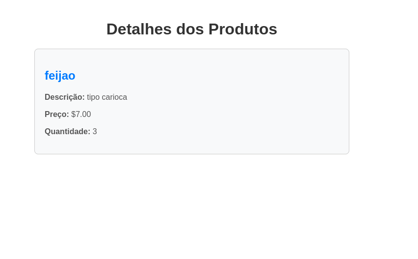
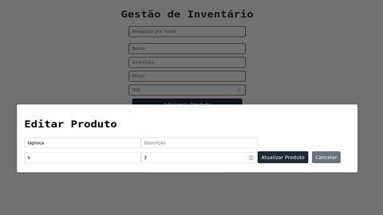

# Sistema de Gestão de Inventário

## Descrição do Projeto

Este projeto consiste em um sistema de gestão de inventário, permitindo que os usuários gerenciem o estoque de uma loja ou armazém. As funcionalidades incluem:

- Cadastro de produtos
- Controle de quantidades
- Entrada e saída de itens
- Geração de relatórios sobre a movimentação de estoque

Apenas o gerente tem acesso ao histórico de movimentações.

---

## TELAS

## Register

## Login

## Home

## Detail

## Editar Produto

## Deletar Produto

## Historico

# COLABORADORES

<table>
  <tr>
    <td align="center">
      <a href="https://github.com/fran-ss">
         
        <b>Franciane Santos</b>
      </a>
    </td>
    <td align="center">
      <a href="https://github.com/Erikaguimaraes">
         
        <b>Erika Guimarães</b>
      </a>
    </td>
    <td align="center">
      <a href="https://github.com/HagataEufrasia">
         
        <b>Maria Hagata</b>
      </a>
    </td>
    <td align="center">
      <a href="https://github.com/RaissaMarques96">
         
        <b>Raissa Marques</b>
      </a>
    </td>
    <td align="center">
      <a href="https://github.com/Gabrielly1704">
         
        <b>Gabrielly</b>
      </a>
    </td>
  </tr>
</table>
